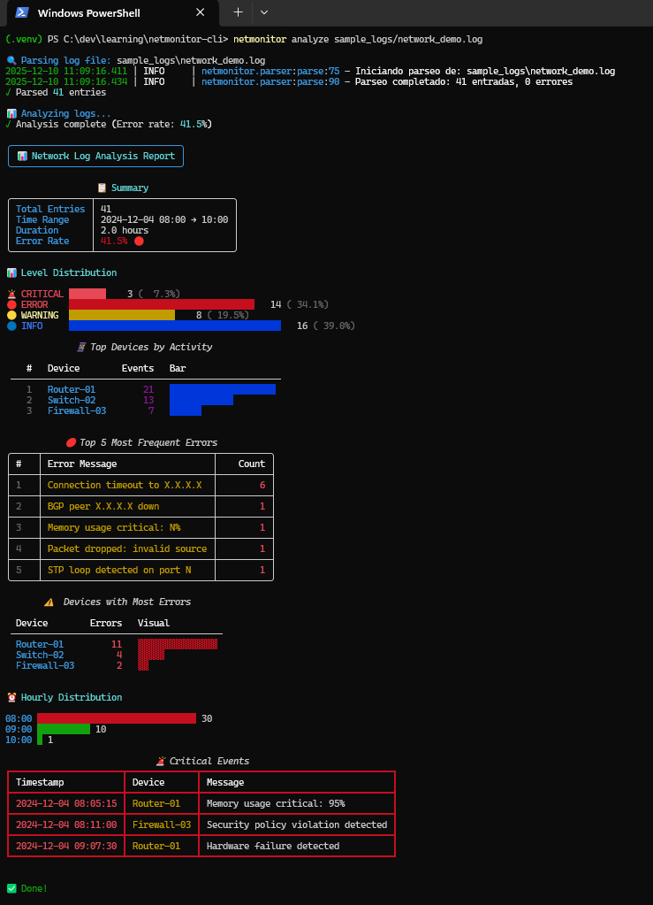
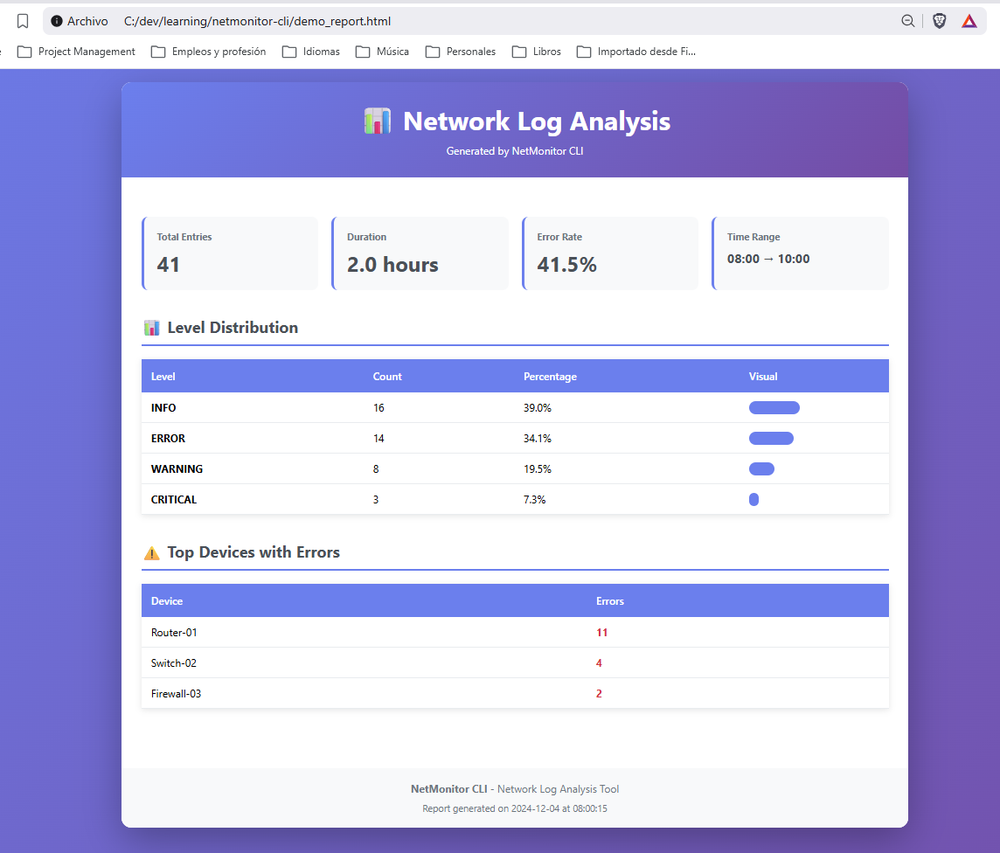

# 📊 NetMonitor CLI

> Professional network log analysis tool with 100% test coverage

[](https://www.python.org/downloads/)
[](tests/)
[](htmlcov/)
[](https://github.com/astral-sh/ruff)
[](LICENSE)

A powerful command-line tool for analyzing network device logs (routers, switches, firewalls) with beautiful visual reports and comprehensive statistics.



---

## ✨ Features

- 🔍 **Smart Log Parsing** - Robust parsing with Pydantic validation
- 📊 **Statistical Analysis** - Error rates, device distribution, time patterns
- 🎨 **Beautiful Reports** - Rich terminal UI with colors and visual bars
- 📁 **Multiple Export Formats** - Console, Text, JSON, and HTML
- ✅ **100% Test Coverage** - 48 tests ensuring reliability
- 🚀 **Professional CLI** - Built with Typer for excellent UX
- 🔧 **Pattern Detection** - Groups similar errors automatically
- ⏰ **Time Analysis** - Hourly distribution and duration tracking

---

## 🚀 Quick Start

### Installation
```bash
# Clone the repository
git clone https://github.com/paraujoq/netmonitor-cli.git
cd netmonitor-cli

# Create virtual environment
python -m venv .venv

# Activate virtual environment
# On Windows:
.venv\Scripts\Activate.ps1
# On Linux/Mac:
source .venv/bin/activate

# Install in development mode
pip install -e .
```

### Try the Demo
```bash
netmonitor demo
```

---

## 📖 Usage

### Basic Analysis

Analyze a log file and display results in the terminal:
```bash
netmonitor analyze network.log
```

### Export to Different Formats

**Text Report:**
```bash
netmonitor analyze network.log -o report.txt -f text
```

**JSON Export:**
```bash
netmonitor analyze network.log -o report.json -f json
```

**HTML Report:**
```bash
netmonitor analyze network.log -o report.html -f html
```

### Command Options
```bash
netmonitor analyze <log-file> [OPTIONS]

Options:
  -o, --output PATH      Output file path
  -f, --format TEXT      Format: console, text, json, html
  -q, --quiet           Suppress progress messages
  --help                Show help message
```

---

## 📊 Sample Output

### Console Report
```
╭──────────────────────────────────╮
│  📊 Network Log Analysis Report  │
╰──────────────────────────────────╯

📋 Summary
┌────────────────┬────────────────┐
│ Total Entries  │ 127            │
│ Time Range     │ 08:00 → 10:00  │
│ Duration       │ 2.0 hours      │
│ Error Rate     │ 41.5% 🔴       │
└────────────────┴────────────────┘

📊 Level Distribution

🚨 CRITICAL  ███ 3   (7.3%)
🔴 ERROR     ████████████████ 14  (34.1%)
🟡 WARNING   ███████ 7   (17.1%)
🔵 INFO      █████████████████ 17  (41.5%)

📱 Top Devices by Activity
┌───┬──────────────┬────────┬──────────────────────┐
│ # │ Device       │ Events │ Bar                  │
├───┼──────────────┼────────┼──────────────────────┤
│ 1 │ Router-01    │     45 │ ████████████████████ │
│ 2 │ Switch-03    │     32 │ ██████████████       │
│ 3 │ Firewall-02  │     28 │ ████████████         │
└───┴──────────────┴────────┴──────────────────────┘
```

### HTML Report

Beautiful, responsive HTML reports with modern design:



---

## 🏗️ Architecture
```
netmonitor-cli/
├── src/netmonitor/
│   ├── parser.py      # Log parsing with Pydantic validation
│   ├── analyzer.py    # Statistical analysis and pattern detection
│   ├── reporter.py    # Visual reports in multiple formats
│   └── main.py        # CLI interface with Typer
├── tests/
│   ├── test_parser.py    # 29 tests
│   └── test_analyzer.py  # 19 tests
├── sample_logs/       # Example log files
└── docs/              # Documentation and screenshots
```

---

## 🧪 Testing

Run the test suite:
```bash
# Run all tests
pytest

# Run with coverage
pytest --cov=netmonitor --cov-report=term-missing

# Run specific test file
pytest tests/test_parser.py -v
```

**Test Results:**
- ✅ 48 tests passing
- ✅ 100% coverage on core modules (parser, analyzer)
- ✅ Parametrized tests for edge cases
- ✅ Performance tests with large datasets

---

## 🛠️ Tech Stack

| Category | Technology |
|----------|-----------|
| **Language** | Python 3.12+ |
| **CLI Framework** | [Typer](https://typer.tiangolo.com/) - Modern CLI with type hints |
| **UI/Display** | [Rich](https://rich.readthedocs.io/) - Beautiful terminal output |
| **Validation** | [Pydantic](https://docs.pydantic.dev/) - Data validation with type hints |
| **Logging** | [Loguru](https://loguru.readthedocs.io/) - Simplified logging |
| **Testing** | [pytest](https://pytest.org/) - Comprehensive testing framework |
| **Coverage** | [pytest-cov](https://pytest-cov.readthedocs.io/) - Code coverage reporting |

---

## 📚 Log Format

NetMonitor expects logs in this format:
```
YYYY-MM-DD HH:MM:SS LEVEL [DEVICE] MESSAGE
```

**Example:**
```
2024-12-04 08:15:23 ERROR [Router-01] Connection timeout to 192.168.1.100
2024-12-04 08:16:45 WARNING [Switch-02] High CPU usage: 85%
2024-12-04 08:17:12 INFO [Firewall-03] Port 443 opened
```

**Supported Levels:**
- `CRITICAL` - Critical system failures
- `ERROR` - Error events
- `WARNING` - Warning messages
- `INFO` - Informational messages
- `DEBUG` - Debug information

---

## 🎯 Use Cases

### Network Operations Center (NOC)
- Monitor router/switch/firewall logs
- Identify recurring connection issues
- Track error rates over time
- Generate executive reports

### Telecom Infrastructure
- Analyze VoLTE/IMS logs
- Track eNodeB failures
- Monitor handover success rates
- Identify problematic network elements

### DevOps/SRE
- Aggregate logs from multiple devices
- Pattern detection in error messages
- Time-based analysis for incident correlation
- Export to JSON for further processing

---

## 🗺️ Roadmap

### Version 0.2.0 (Planned)
- [ ] Real-time log monitoring (`netmonitor watch`)
- [ ] Multiple file analysis
- [ ] Advanced filtering by time range
- [ ] Custom log format configuration
- [ ] Email alerts for critical events

### Version 0.3.0 (Future)
- [ ] Web dashboard
- [ ] Database integration (SQLite/PostgreSQL)
- [ ] Historical trend analysis
- [ ] Machine learning for anomaly detection
- [ ] Integration with Grafana/Prometheus

---

## 🤝 Contributing

Contributions are welcome! Please feel free to submit a Pull Request.

1. Fork the repository
2. Create your feature branch (`git checkout -b feature/AmazingFeature`)
3. Commit your changes (`git commit -m 'Add some AmazingFeature'`)
4. Push to the branch (`git push origin feature/AmazingFeature`)
5. Open a Pull Request

---

## 📄 License

This project is licensed under the MIT License - see the [LICENSE](LICENSE) file for details.

---

## 👨‍💻 Author

**Pedro Araujo**
- Role: Senior PM Telecom → Full Stack Developer
- Project: Learning journey - Week 1
- LinkedIn: (https://www.linkedin.com/in/pcaq/)
- GitHub: [@paraujoq](https://github.com/paraujoq)

---

## 🙏 Acknowledgments

- Built as part of a structured learning path from PM to Full Stack Developer
- Inspired by real-world telecom network monitoring needs
- Uses modern Python best practices and professional tooling

---

## 📊 Project Stats
```
Lines of Code:    ~800 (excluding tests)
Test Coverage:    100% (core modules)
Tests:            48 passing
Development Time: 7 days (structured learning)
Commits:          10+ with clear messages
```

---

## 💡 Learning Outcomes

This project demonstrates:
- ✅ Modern Python (3.12+, type hints, dataclasses)
- ✅ CLI development with Typer
- ✅ Data validation with Pydantic
- ✅ Professional testing with pytest
- ✅ Visual terminal UI with Rich
- ✅ Git workflow and version control
- ✅ Project structure and organization
- ✅ Documentation and README best practices

---

<div align="center">

**[⭐ Star this repo](https://github.com/your-username/netmonitor-cli)** if you find it useful!

Made with ❤️ and Python

</div>